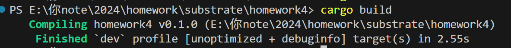
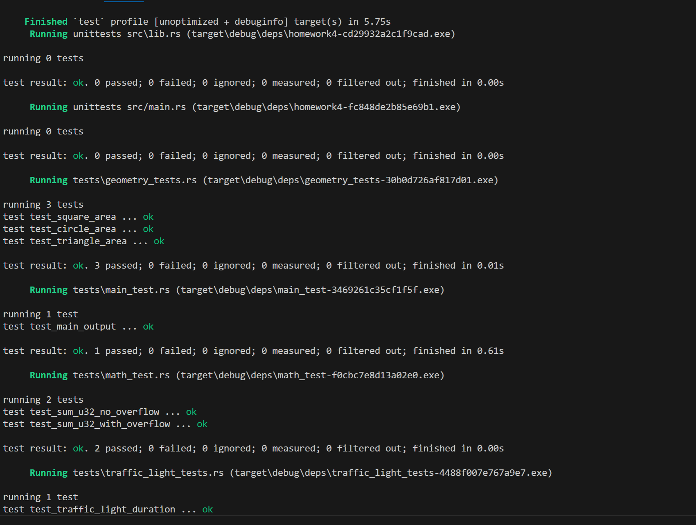

# homework-4
## 文件目录

```plaintext
homework4/
├── Cargo.toml
├── src/
│   ├── main.rs       # 主程序入口
│   ├── lib.rs        
│   ├── traffic_light.rs  # 红绿灯枚举
│   ├── math.rs           # 整数集合求和
│   ├── geometry.rs       # 打印图形面积
└── tests/
    ├── main_tests.rs      
    ├── traffic_light_tests.rs
    ├── math_tests.rs
    └── geometry_tests.rs
```
## 构建、运行与测试
build:`cargo build`
run:`cargo run`
test:`cargo build`

## 构建截图

## 运行截图

## 测试截图


