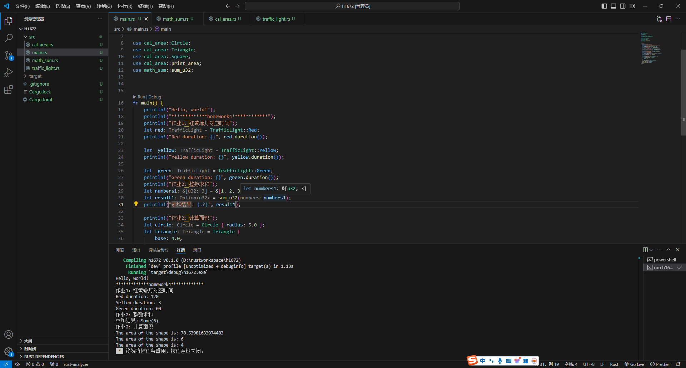

# 1.代码

- 红绿灯展示对应时间  <font color=red>traffic_light.rs</font>

  ```rust
  /// 定义一个枚举表示交通信号灯
  
  pub enum TrafficLight {
      Red,
      Yellow,
      Green,
  }
  
  /// 定义一个 Trait 用于返回交通信号灯持续时间  u16范围0到65535
  pub trait LightDuration {
      fn duration(&self) -> u16;
  }
  
  /// 为 TrafficLight 实现 LightDuration Trait
  impl LightDuration for TrafficLight {
      fn duration(&self) -> u16 {
          match self {
              // 红灯120s
              TrafficLight::Red => {120}
              // 黄灯3s
              TrafficLight::Yellow => {3}
              // 绿灯60s
              TrafficLight::Green => {60}
          }
      }
  }
  ```

- 整数求和 <font color=red>math_sum.rs</font>

  ```rust
  pub fn sum_u32(numbers: &[u32]) -> Option<u32> {
      numbers
          .iter()
          .try_fold(0u32, |acc: u32, &x: &u32| acc.checked_add(x))
  }
  ```

- 计算面积 <font color=red>cal_area.rs</font>

  ```rust
  // 实现一个打印图形面积的函数，它接收一个可以计算面积的类型作为参数，比如圆形，三角形，正方形，需要用到泛型和泛型约束。
  
  use std::f64::consts::PI;
  
  pub trait MeasurableArea {
      fn area(&self) -> Result<f64, String>;
  }
  
  pub struct Circle {
      pub radius: f64,
  }
  
  impl MeasurableArea for Circle {
      fn area(&self) -> Result<f64, String> {
          if self.radius < 0.0 {
              return Err("Radius cannot be negative".to_string());
          }
          Ok(PI * self.radius * self.radius)
      }
  }
  
  pub struct Triangle {
      pub base: f64,
      pub height: f64,
  }
  
  impl MeasurableArea for Triangle {
      fn area(&self) -> Result<f64, String> {
          if self.base < 0.0 || self.height < 0.0 {
              return Err("Base and height cannot be negative".to_string());
          }
          Ok(0.5 * self.base * self.height)
      }
  }
  
  pub struct Square {
      pub side: f64,
  }
  
  impl MeasurableArea for Square {
      fn area(&self) -> Result<f64, String> {
          if self.side < 0.0 {
              return Err("Side cannot be negative".to_string());
          }
          Ok(self.side * self.side)
      }
  }
  
  pub fn print_area<T: MeasurableArea>(shape: &T) {
      match shape.area() {
          Ok(area) => println!("The area of the shape is: {}", area),
          Err(e) => println!("Error calculating area: {}", e),
      }
  }
  ```

- 主函数运行 <font color=red>main.rs</font>

  ```rust
  mod  traffic_light;
  mod cal_area;
  mod math_sum;
  
  use traffic_light::TrafficLight;
  use traffic_light::LightDuration;
  
  use cal_area::Circle;
  use cal_area::Triangle;
  use cal_area::Square;
  use cal_area::print_area;
  use math_sum::sum_u32;
  
  
  
  fn main() {
      println!("Hello, world!");
      println!("*************homework4*************");
      println!("作业1：红黄绿灯对应时间");
      let red = TrafficLight::Red;
      println!("Red duration: {}", red.duration());
  
      let  yellow = TrafficLight::Yellow;
      println!("Yellow duration: {}", yellow.duration());
  
      let  green = TrafficLight::Green;
      println!("Green duration: {}", green.duration());
      println!("作业2：整数求和");
      let numbers1 = &[1, 2, 3];
      let result1 = sum_u32(numbers1);
      println!("求和结果: {:?}", result1);
  
      println!("作业2：计算面积");
      let circle = Circle { radius: 5.0 };
      let triangle = Triangle {
          base: 4.0,
          height: 3.0,
      };
      let square = Square { side: 2.0 };
      print_area(&circle);
      print_area(&triangle);
      print_area(&square);
     
  }
  ```


# 2.运行结果展示

