# homework-5-1642

## 运行命令

### 编译

```bash
cargo build --release
```

```bash
cargo check
```

### 测试

```bash
cargo test
```

### 运行

```bash
./target/release/solochain-template-node --dev --tmp
```

> - alice
> 
> - 5GrwvaEF5zXb26Fz9rcQpDWS57CtERHpNehXCPcNoHGKutQY
---
> - bob
> 
> - 5FHneW46xGXgs5mUiveU4sbTyGBzmstUspZC92UhjJM694ty

## 运行截图

### 测试

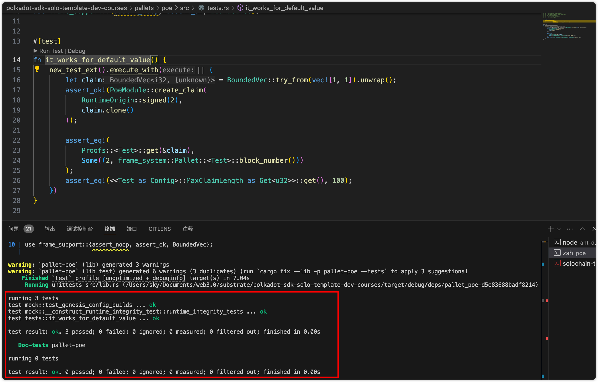

### 运行

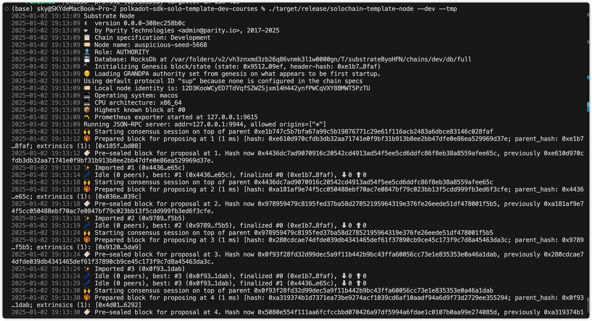

### 本地连接polkadot.js

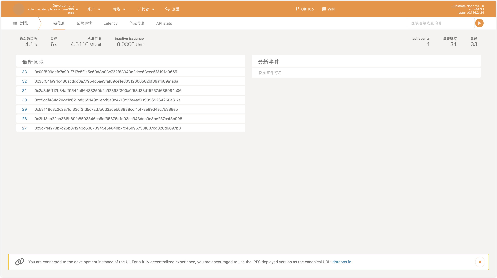

### createClaim


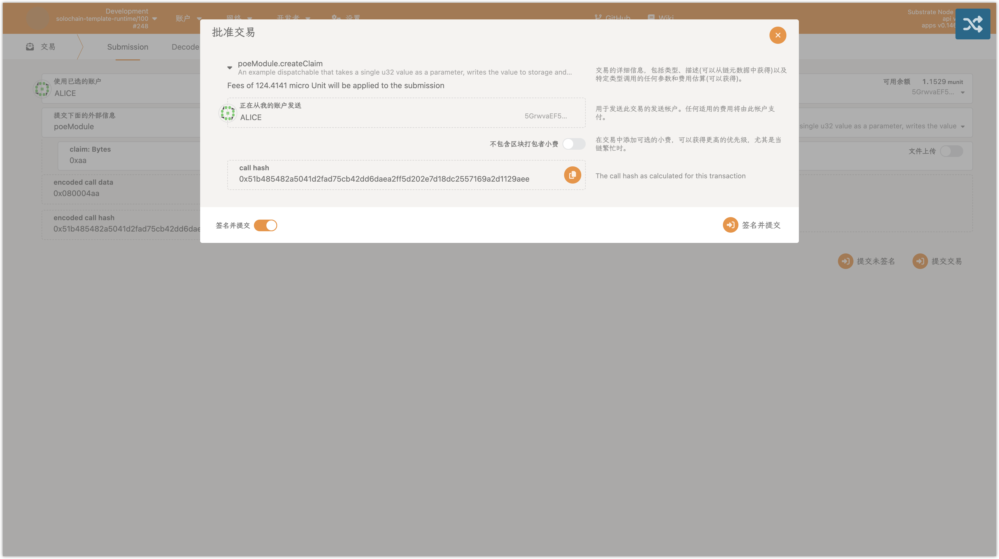
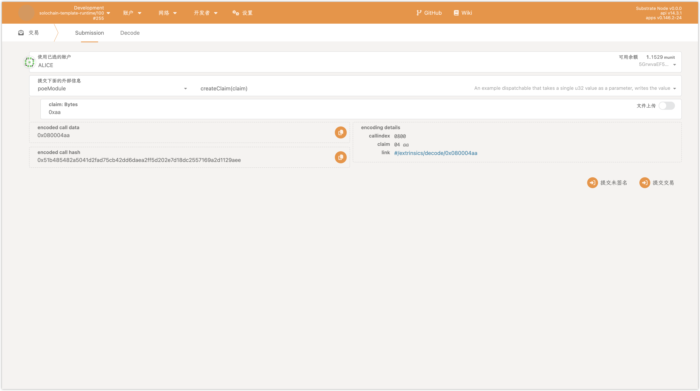

### revokeClaim

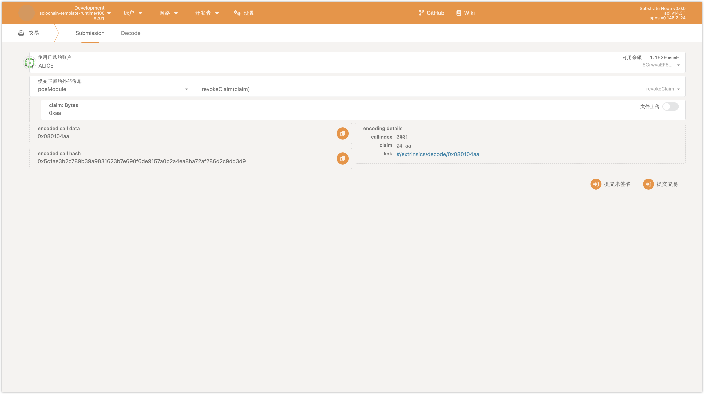
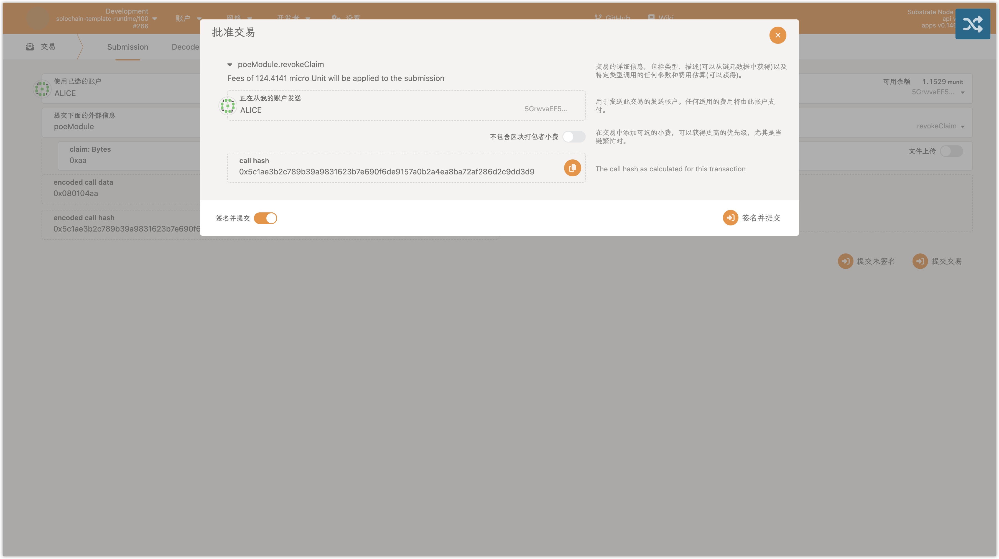
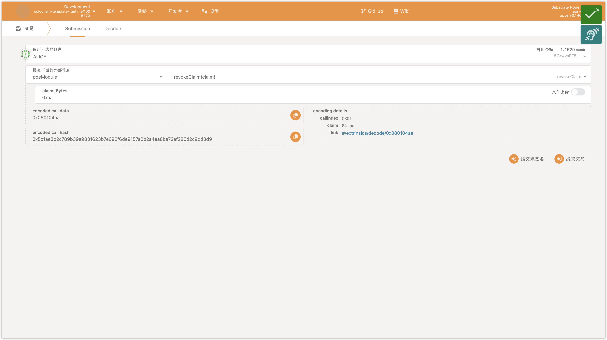

### transferClaim


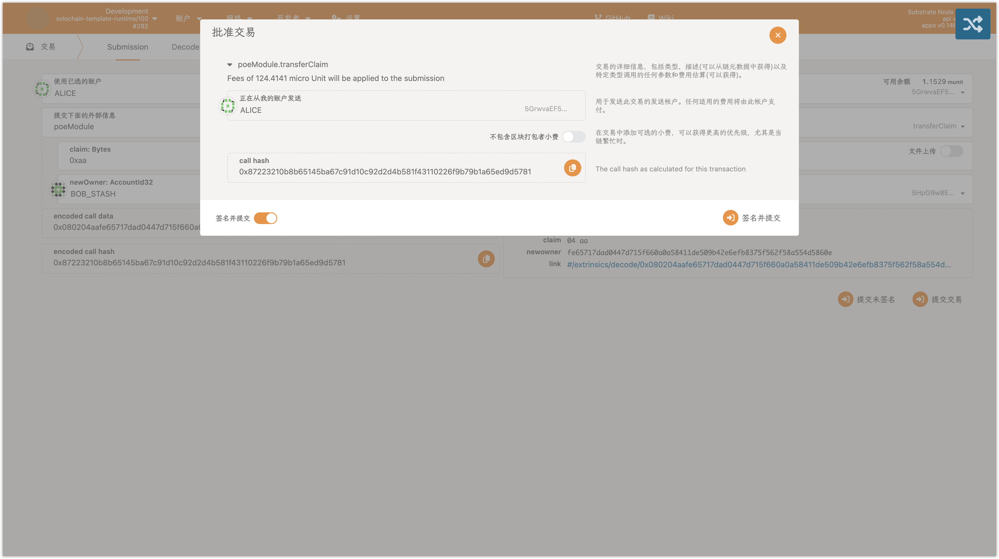
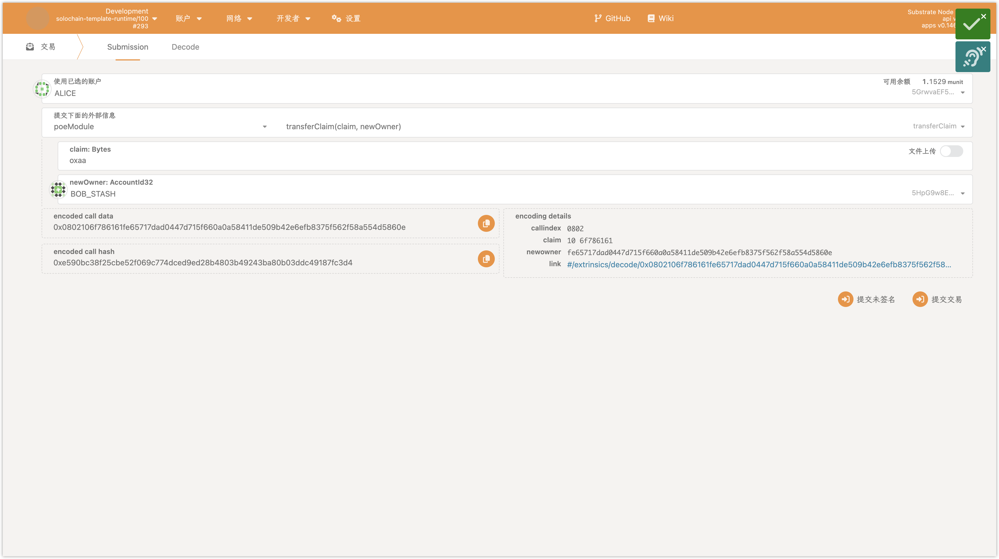

### transfer result

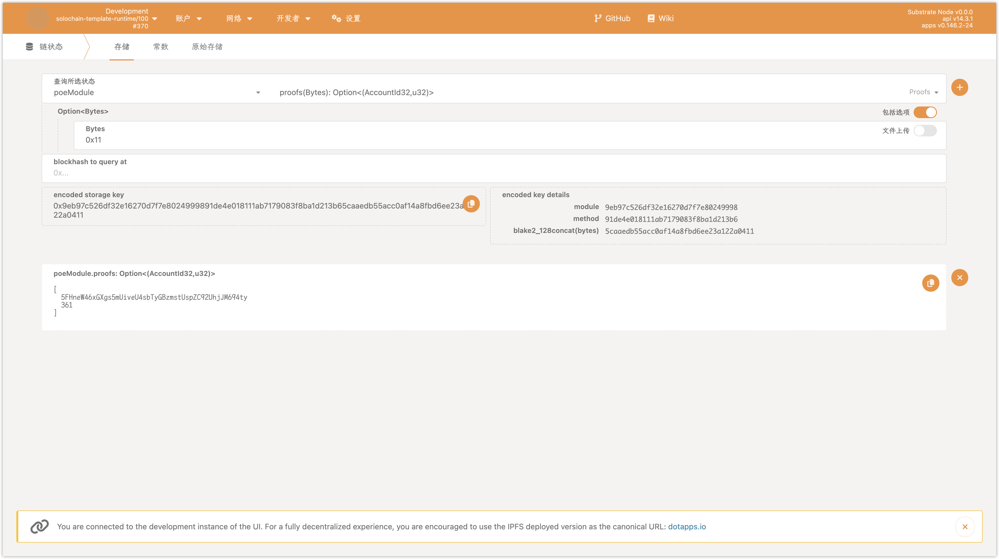
